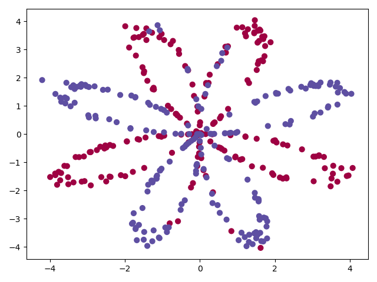
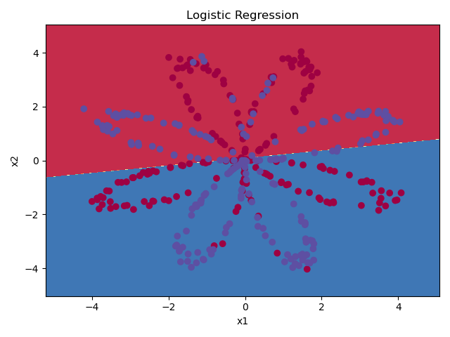
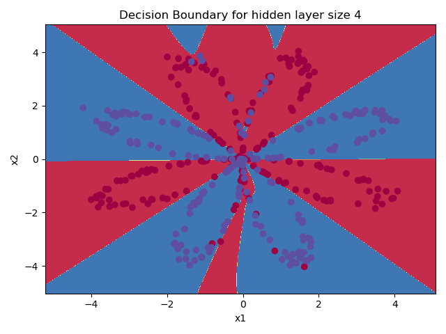

1-hidden layer NN from Andrew NG's Coursera deelearning.ai 

## Data Visualization:  
  

## SKlearn's Logistic Regression Decision Boundary:  
   

## SKLearn's Logistic Regression Accuracy
0.47

## 1 hidden layer, 64 hidden neurons, Neural Net Decision Boundary

## ANN train accuracy, 8000 iterations
0.9125  

